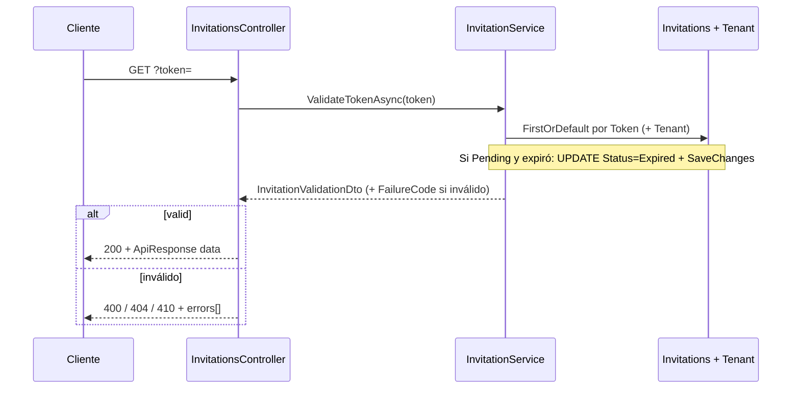

# GET `/api/invitations/validate` — Construcción técnica

Documento de referencia para desarrollo: cómo está implementada la **validación de un token de invitación** (enlace enviado por correo) en la API DataColor. El front suele llamarla al abrir la URL con `?token=` para decidir si mostrar la pantalla de definir contraseña y qué datos mostrar.

---

## 1. Resumen

| Aspecto | Detalle |
|--------|---------|
| **Método y ruta** | `GET /api/invitations/validate` |
| **Proyecto API** | `DataColor.Api` |
| **Controlador** | `InvitationsController` → acción `ValidateToken` |
| **Servicio** | `IInvitationService` → `InvitationService.ValidateTokenAsync` (`DataColor.Infrastructure`) |
| **Autenticación previa** | **No:** el controlador lleva **`[AllowAnonymous]`** (ruta pública; no requiere JWT). |
| **Query** | **`token`** (string): token único de la invitación (mismo valor embebido en el enlace de aceptación). |
| **Respuesta HTTP** | **`200`** solo si la invitación es válida (`valid: true`). **400 / 404 / 410** según el motivo (semántica HTTP; ver §6). **Cambio respecto a versiones que siempre devolvían 200:** el cliente debe tratar el código HTTP, no solo `data.valid`. |
| **Éxito** | `200` + `ApiResponse<InvitationValidationDto>` |
| **Fallo** | Cuerpo con formato **`errors[]`** (`ApiErrorResponses`), alineado con el resto de la API. |
| **Efecto secundario** | Ver §5.1: en caso de expiración detectada puede **escribirse** en BD (`Status = Expired`). |

La ruta se resuelve por `[Route("api/invitations")]` + `[HttpGet("validate")]` → `/api/invitations/validate`.

---

## 2. Flujo de capas

---

## 3. Contrato de entrada

| Parámetro | Ubicación | Obligatorio | Notas |
|-----------|-----------|-------------|--------|
| `token` | Query (`?token=...`) | Sí para un resultado **200** | Vacío o ausente → **400** (*Token no proporcionado.*). El controlador pasa `token ?? ""`. |

Ejemplo: `GET /api/invitations/validate?token=abc123...`

---

## 4. Contrato de salida si **200 OK**

Envoltorio: `ApiResponse<InvitationValidationDto>`.

DTO: `DataColor.Core/DTOs/InvitationDtos.cs` → `InvitationValidationDto`.

| Propiedad (JSON `camelCase`) | Tipo | Notas |
|------------------------------|------|--------|
| `valid` | `boolean` | `true` en respuestas **200**. |
| `failureCode` | `number` (enum) | `0` (`None`) cuando es válido. |
| `email` | `string` | Email invitado. |
| `tenantName` | `string` \| `null` | Nombre del tenant (`Tenant.Name`). |
| `firstName` | `string` \| `null` | Opcional en la invitación. |
| `lastName` | `string` \| `null` | Opcional en la invitación. |
| `expiresAt` | `string` (ISO 8601) | Fecha de expiración UTC. |
| `errorMessage` | `null` | En éxito no aplica. |

El servicio también rellena `FailureCode` en el DTO cuando `valid === false` (uso interno y mapeo en el controlador); en respuestas **4xx** el cuerpo **no** incluye `ApiResponse` con ese DTO, solo **`errors[]`**.

---

## 5. Lógica de negocio (`ValidateTokenAsync`) y mapeo HTTP

`InvitationService.ValidateTokenAsync` devuelve un DTO con **`InvitationValidationFailureCode`** (`failureCode` en JSON):

| Código | Significado |
|--------|-------------|
| `TokenMissing` | Token vacío o ausente. |
| `TokenNotFound` | No existe invitación con ese `Token`. |
| `NotPending` | Estado distinto de `Pending` (aceptada, cancelada, etc.). |
| `Expired` | Fecha de expiración pasada; el servicio marca la fila como **`Expired`** y persiste. |

`InvitationsController` traduce a HTTP:

| `FailureCode` | HTTP | Título típico en `errors[0].title` |
|---------------|------|-----------------------------------|
| `TokenMissing` | **400** | *Respuesta con error* |
| `TokenNotFound` | **404** | *No encontrado* |
| `NotPending`, `Expired` | **410** | *Recurso no disponible* (Gone) |

El texto detallado va en `errors[0].detail` (mismos mensajes que antes: *Token no proporcionado.*, *Enlace inválido o ya utilizado.*, etc.).

---

## 5.1 GET y efectos secundarios (expiración)

En el modelo HTTP clásico, **GET** debería ser **seguro** (sin cambios de estado en el servidor). Aquí hay una salvedad:

- Si la invitación está **`Pending`** pero **`ExpiresAt` &lt; ahora (UTC)**, el servicio asigna **`Status = Expired`**, llama a **`SaveChangesAsync`** y devuelve fallo (**410** vía `FailureCode.Expired`).
- El resto de ramas (**token vacío**, **no encontrado**, **ya no Pending** por otro motivo) **no** escriben en BD.

**Por qué puede aceptarse:** actualizar el estado al “descubrir” la expiración mantiene la fila alineada con la realidad y evita dejar `Pending` eternamente; el coste es que **no es un GET puramente idempotente en el sentido de “nunca muta datos”**: la primera petición válida tras el vencimiento puede cambiar la fila. Una petición repetida con el mismo token verá entonces **`NotPending`** (estado ya `Expired`), no el mismo cuerpo que la primera vez en todos los campos de mensaje.

**Alternativas de diseño** (no implementadas): job programado que expire filas; solo marcar expiración en **POST /accept**; GET solo lectura y expiración “lógica” sin persistir (listados seguirían mostrando `Pending` hasta otro flujo).

---

## 6. Errores y códigos HTTP

| HTTP | Cuándo |
|------|--------|
| **200** | Invitación válida: `Pending`, no expirada, token existente. |
| **400** | Token vacío / no enviado (petición mal formada). |
| **404** | Token desconocido (ninguna fila con ese valor). |
| **410** | Invitación ya no usable: usada/cancelada (no `Pending`) o expirada. |

**Cuerpo de error:** `{ "errors": [ { "status", "title", "detail" } ] }` vía `ApiErrorResponses` (`BadRequest`, `NotFound`, `Gone`).

---

## 7. Archivos clave

| Archivo | Rol |
|---------|-----|
| `DataColor.Api/Controllers/InvitationsController.cs` | `GET validate`, mapeo `FailureCode` → HTTP |
| `DataColor.Api/Responses/ApiErrorResponses.cs` | `NotFound`, `Gone` |
| `DataColor.Infrastructure/Services/InvitationService.cs` | `ValidateTokenAsync`, estados `Pending` / `Expired` |
| `DataColor.Core/DTOs/InvitationDtos.cs` | `InvitationValidationDto`, `InvitationValidationFailureCode` |
| `DataColor.Core/Interfaces/IInvitationService.cs` | Contrato del servicio |
| `DataColor.Core/Entities/Invitation.cs` | Entidad (`Token`, `Status`, `ExpiresAt`, …) |

---

## 8. Relación con otros endpoints

- Creación y listado de invitaciones: rutas bajo **`/api/tenants/{tenantId}/invitations`** (autenticadas).
- Aceptación (definir contraseña): [POST-api-invitations-accept.md](./POST-api-invitations-accept.md) (`POST /api/invitations/accept`).

---

*Documento alineado con el código del repositorio.*
