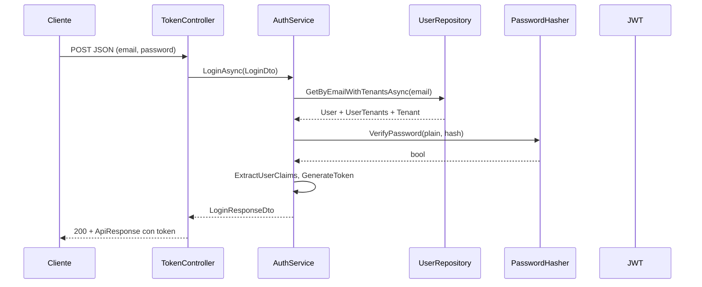

# POST `/api/token/login` — Construcción técnica

Documento de referencia para desarrollo: cómo está implementado el inicio de sesión en la API DataColor (ASP.NET Core), desde la ruta HTTP hasta la emisión del JWT.

---

## 1. Resumen

| Aspecto | Detalle |
|--------|---------|
| **Método y ruta** | `POST /api/token/login` |
| **Proyecto API** | `DataColor.Api` |
| **Controlador** | `TokenController` → acción `Authentication` |
| **Servicio** | `IAuthService` → `AuthService` (`DataColor.Core`) |
| **Autenticación previa** | No: el endpoint es **público** (no lleva `[Authorize]`) |
| **Respuesta exitosa** | `200 OK` con envoltorio `ApiResponse<LoginResponseDto>` |
| **Errores típicos** | `400` (modelo inválido); `401` / `403` vía `AuthenticationException` (ver §8); `429` por rate limiting (ver §8.4) |

La ruta final se obtiene por convención de ASP.NET Core: `[Route("api/[controller]")]` + `[HttpPost("login")]` y el nombre del controlador `TokenController` → segmento `token`.

En Swagger/OpenAPI, la acción declara `200`, `400`, `401` y `403` (`TokenController.Authentication`).

---

## 2. Flujo de capas



1. **Presentación:** `TokenController.Authentication` recibe el cuerpo como `LoginDto` y delega en `_authService.LoginAsync`.
2. **Dominio / aplicación:** `AuthService.LoginAsync` valida usuario, contraseña y estado; arma claims; firma el JWT.
3. **Infraestructura de datos:** `UserRepository.GetByEmailWithTenantsAsync` carga el usuario y relaciones necesarias para multi-tenant.
4. **Respuesta HTTP:** Se envuelve el DTO en `ApiResponse<LoginResponseDto>` y se devuelve `Ok(...)`.

Referencias en código:

- Controlador: `DataColor.Api/Controllers/TokenController.cs`
- Lógica de login y JWT: `DataColor.Core/Services/AuthService.cs`
- Repositorio: `DataColor.Infrastructure/Repositories/UserRepository.cs`

---

## 3. Contrato de entrada

El modelo `LoginDto` define únicamente:

| Propiedad | Tipo | Uso |
|-----------|------|-----|
| `Email` | `string` | Búsqueda del usuario (comparación **insensible a mayúsculas** en BD) |
| `Password` | `string` | Texto plano enviado por el cliente; se compara contra el hash almacenado |

Archivo: `DataColor.Core/DTOs/LoginDto.cs`.

La API serializa JSON en **camelCase** (`email`, `password`) por configuración global en `Program.cs` (`PropertyNamingPolicy = CamelCase`, `PropertyNameCaseInsensitive = true`).

Las reglas del cuerpo están centralizadas en **`LoginDtoValidator`** (`DataColor.Infrastructure/Validators/LoginDtoValidator.cs`), descubierto por **`AddValidatorsFromAssemblies`**. Coinciden con el registro en email y contraseña:

| Campo | Reglas |
|--------|--------|
| `email` | Requerido, formato email, máx. **254** caracteres (alineado con RFC 5321 y columna `Usuario.Email` en BD) |
| `password` | Requerida, entre 6 y 100 caracteres |

Si falla la validación, **`ValidationFilter`** responde **`400 Bad Request`** con el detalle estándar de `ModelState` **antes** de ejecutar `AuthService.LoginAsync`.

---

## 4. Lógica de negocio (`LoginAsync`)

Orden aproximado de operaciones en `AuthService.LoginAsync`:

1. **Carga del usuario:** `GetByEmailWithTenantsAsync(loginDto.Email)` incluye `UserTenants` y `Tenant` para poder construir claims multi-tenant.
2. **Usuario inexistente:** se lanza **`AuthenticationException`** (HTTP **401**) con mensaje genérico (*"Usuario o contraseña incorrectos"*) para no filtrar si el email existe.
3. **Usuario inactivo:** **`AuthenticationException`** (HTTP **403**) — *"El usuario está inactivo"*.
4. **Contraseña:** `IPasswordHasher.VerifyPassword(loginDto.Password, user.PasswordHash)`. Si falla, **`AuthenticationException`** (HTTP **401**) con el mismo mensaje genérico que en el punto 2.
5. **Tipo de usuario:** a partir de `user.UserType` se obtiene el string `"Internal"` o `"Customer"`.
6. **Claims auxiliares:** `ExtractUserClaims`:
   - **Internal:** lista de roles internos derivados del rol de aplicación (`ExtractInternalRoles`), p. ej. plataforma.
   - **Customer:** pares `(tenantId, RoleInTenant)` solo para membresías **activas** y tenants **activos**; si no hay ninguno, la lista queda vacía y no se añade claim `tenant` (el código comenta que no bloquea el login en ese caso).
7. **JWT:** `GenerateToken(...)` con id, email, rol global, nombre completo, tipo de usuario, tenants y roles internos.
8. **Respuesta:** se rellena `LoginResponseDto` (token + datos básicos del usuario).

---

## 5. Hash de contraseña

Implementación: `PasswordHasherService` (`DataColor.Core/Services/PasswordHasherService.cs`), registrado como singleton:

- Algoritmo: **PBKDF2** (`Rfc2898DeriveBytes`) con **SHA-256**.
- Formato almacenado: `$pbkdf2$<iterations>$<saltBase64>$<hashBase64>`.
- Parámetros por configuración (`PasswordHashing` en `appsettings`): `Iterations`, `SaltSize`, `HashSize` (ver `PasswordHashingOptions`).

La verificación usa comparación en tiempo constante sobre los bytes del hash.

---

## 6. Generación del JWT

Método relevante: `AuthService.GenerateToken`.

| Elemento | Valor |
|----------|--------|
| Firma | **HMAC SHA256** con clave simétrica (`SymmetricSecurityKey` desde `Authentication:SecretKey`) |
| Emisor / audiencia | `Authentication:Issuer` y `Authentication:Audience` |
| Validez | **60 minutos** desde `DateTime.UtcNow` (`expires` en `JwtSecurityToken`) |
| Claims estándar | `NameIdentifier` (id usuario), `Name` (nombre completo), `Email`, `Role` (rol global de aplicación), `userType` (`Internal` / `Customer`) |
| Claim **`security_stamp`** | GUID en formato `D`; debe coincidir con `User.SecurityStamp` en BD. Si se rota el sello en servidor, los JWT anteriores dejan de ser válidos (ver §6.1). |
| Claims adicionales | Si `Internal` y hay roles: claim **`internalRoles`** con JSON array de strings. Si `Customer` y hay tenants: claim **`tenant`** con JSON array de strings `"<tenantId>:<role>"` |

Constante de nombre de claim: `AuthClaimTypes.SecurityStamp` (`DataColor.Core/Constants/AuthClaimTypes.cs`).

### 6.1 Invalidación de sesiones (`SecurityStamp`)

- El valor se guarda en **`Usuario.SecurityStamp`** (columna `SecurityStamp`, migración `AddUserSecurityStamp`).
- Se **genera** al registrar usuario o al crear usuario por invitación; se **rota** (`Guid.NewGuid()`) al **cambiar contraseña** y al **cambiar el estado activo** del usuario desde administración (`AdminUserService.UpdateUserStatusAsync`).
- Tras `UseAuthentication`, el middleware **`SecurityStampValidationMiddleware`** (`DataColor.Api/Middleware/SecurityStampValidationMiddleware.cs`) comprueba, en cada request autenticada, que el claim coincida con BD y que el usuario siga activo. Si falta el claim (tokens emitidos antes del despliegue), la API responde **401** pidiendo iniciar sesión de nuevo.
- **No** sustituye a un refresh token opaco ni resuelve por sí solo claims obsoletos de **tenant/rol** en el JWT: para eso sigue aplicando `POST /api/token/refresh` y las cabeceras `X-Requires-Reauth` donde corresponda.
- La política **`TenantMember`**, el middleware **`TenantContextMiddleware`** y el controlador de tenants validan membresía y rol contra **BD** (`ITenantMemberAccessService`), no solo contra el claim `tenant` del token.

Configuración JWT Bearer para **validar** tokens en el resto de la API está en `Program.cs` (`AddJwtBearer` + `TokenValidationParameters` alineados con la misma clave, issuer y audience).

---

## 7. Contrato de salida (éxito)

El controlador devuelve:

```csharp
new ApiResponse<LoginResponseDto>(loginResponse)
```

Estructura de `LoginResponseDto` (`DataColor.Core/DTOs/LoginResponseDto.cs`):

| Propiedad | Descripción |
|-----------|-------------|
| `Token` | Cadena JWT |
| `IdUsuario` | Identificador numérico del usuario |
| `Email` | Correo |
| `Rol` | Rol global en la aplicación (distinto del rol dentro de un tenant) |
| `FullName` | `FirstName` + `LastName` |

La envoltura `ApiResponse<T>` (`DataColor.Api/Responses/ApiResponses.cs`) expone `data`, `meta` opcional y `requiresReauth` (por defecto `false` en login).

---

## 8. Errores y códigos HTTP

### 8.1 Login (`POST /api/token/login`)

El filtro global **`GlobalExceptionFilter`** (`DataColor.Infrastructure/Filters/GlobalExceptionFilter.cs`) convierte **`AuthenticationException`** en respuesta JSON con el **`StatusCode`** de la excepción (propiedad `StatusCode` en código; en JSON suele serializarse en **camelCase** según opciones de `Program.cs`).

| HTTP | Cuándo | `title` en el cuerpo |
|------|--------|----------------------|
| **401** | Email sin usuario en BD, o contraseña incorrecta | *No autorizado* |
| **403** | Usuario existe pero `IsActive` es falso | *Acceso denegado* |

Mensaje en **`detail`**: para credenciales incorrectas siempre el genérico *"Usuario o contraseña incorrectos"*; para inactivo, la constante **`AuthenticationException.InactiveUserMessage`** (*"El usuario está inactivo"*).

**Consistencia (cuenta inactiva):** el mismo criterio `User.IsActive == false` usa **`AuthenticationException.InactiveUser()`** (siempre **403**) en login, refresh, cambio de contraseña, subida de avatar y generación de URL OAuth Facebook, para que clientes y observabilidad traten el estado igual en toda la API.

Formato del cuerpo (estructura):

```json
{
  "errors": [
    {
      "status": 401,
      "title": "No autorizado",
      "detail": "Usuario o contraseña incorrectos"
    }
  ]
}
```

### 8.2 Otros códigos en la misma API

- **`BusinessException`**: reglas de negocio que **no** son autenticación → **`400 Bad Request`**, `title`: *"Respuesta con error"*.
- **`ModelState` inválido** (`ValidationFilter`): **`400`** con el detalle estándar de validación de ASP.NET Core.

### 8.4 Rate limiting (`LoginRateLimitFilter`)

Antes de ejecutar la acción de login, el filtro **`LoginRateLimitFilter`** (`DataColor.Api/Filters/LoginRateLimitFilter.cs`) aplica dos ventanas fijas (`System.Threading.RateLimiting.FixedWindowRateLimiter`):

| Límite | Comportamiento por defecto (`appsettings`: `RateLimiting:Login`) |
|--------|------------------------------------------------------------------|
| Por **IP** | Hasta **10** solicitudes por **1** minuto por dirección remota. |
| Por **email** | Hasta **5** solicitudes por **15** minutos por correo normalizado (`trim` + minúsculas). |

Si se supera **primero** el límite por IP, se responde **429** sin evaluar el email. Si la IP pasa y el cuerpo incluye email, se aplica el límite por email.

- **HTTP 429 Too Many Requests** con cuerpo `{ "errors": [ { "status": 429, "title": "Demasiados intentos", "detail": "<mensaje>" } ] }` (mensaje distinto para IP vs email).
- Cabecera **`Retry-After`**: segundos sugeridos hasta el siguiente intento (según metadatos del limitador; si no hay metadato, **60**).
- **Logging:** `LogWarning` con categoría `Login rate limit exceeded`, incluye `LimitType` (`ip` / `email`), `PartitionKey`, `RemoteIp` y email normalizado.

Los valores se pueden ajustar en configuración sin recompilar (propiedades `IpPermitLimit`, `IpWindowMinutes`, `EmailPermitLimit`, `EmailWindowMinutes`). El estado se mantiene **en memoria** por instancia del proceso (sin Redis); en varias réplicas de la API cada instancia aplica sus propios contadores.

### 8.3 Pipeline y middleware

En acciones MVC, lo habitual es que **`GlobalExceptionFilter`** resuelva la respuesta antes de salir del pipeline. Si una **`AuthenticationException`** o **`BusinessException`** llegara a **`ExceptionHandlingMiddleware`**, ese middleware aplica el **mismo criterio de códigos** y además incluye **`CorrelationId`** en cada error del array (`DataColor.Api/Middleware/ExceptionHandlingMiddleware.cs`).

---

**Nota:** `RefreshTokenAsync` también usa `AuthenticationException` (401 si el usuario del token ya no existe, 403 si está inactivo); eso aplica a **`POST /api/token/refresh`**, no al login.

---

## 9. Registro en DI y pipeline

- `IAuthService` → `AuthService` con ámbito **Transient** (`Program.cs`).
- Filtros globales: `GlobalExceptionFilter` en `AddControllers`; `ValidationFilter` en `AddMvc`.
- `LoginRateLimitFilter` registrado como **singleton** y aplicado solo a `POST /api/token/login` vía `[ServiceFilter]` (`LoginRateLimitOptions` → sección `RateLimiting:Login`).
- `ITenantMemberAccessService` → `TenantMemberAccessService` con ámbito **scoped** (`Program.cs`); usado por la política `TenantMember`, `TenantContextMiddleware` y `TenantsController`.
- Orden del pipeline relevante: `UseAuthentication` → **`SecurityStampValidationMiddleware`** → `TenantContextMiddleware` → `UseAuthorization`.
- **Login/register** no envían JWT; el middleware de sello solo actúa si `User.Identity.IsAuthenticated`.

---

## 10. Relación con multi-tenant

Tras un login correcto, el JWT puede incluir el claim `tenant` para usuarios **Customer** con membresías activas (snapshot al emitir el token). El cliente suele enviar además el tenant activo en cabeceras en rutas que lo exigen (p. ej. `X-Tenant-Id`), según la documentación funcional del proyecto. El rol **global** del JSON de login **no** sustituye al rol por organización. Para operaciones que requieren saber el rol actual en la organización, la API consulta **`UserTenant`** en BD vía `ITenantMemberAccessService` (política `TenantMember`, contexto de tenant y acciones en `TenantsController`); el claim `tenant` no es la única fuente de verdad para autorización multi-tenant.

---

## 11. Archivos clave (checklist)

| Archivo | Rol |
|---------|-----|
| `DataColor.Api/Controllers/TokenController.cs` | Ruta HTTP y respuesta |
| `DataColor.Core/Services/AuthService.cs` | `LoginAsync`, `GenerateToken`, `ExtractUserClaims` |
| `DataColor.Core/Exceptions/AuthenticationException.cs` | 401/403; fábrica `InactiveUser()` para cuenta deshabilitada |
| `DataColor.Infrastructure/Filters/GlobalExceptionFilter.cs` | Mapeo de excepciones a respuestas HTTP |
| `DataColor.Core/DTOs/LoginDto.cs` / `LoginResponseDto.cs` | Contratos |
| `DataColor.Infrastructure/Validators/LoginDtoValidator.cs` | Validación explícita del cuerpo de login |
| `DataColor.Infrastructure/Repositories/UserRepository.cs` | `GetByEmailWithTenantsAsync` |
| `DataColor.Core/Services/PasswordHasherService.cs` | PBKDF2 |
| `DataColor.Api/Program.cs` | JWT, JSON, filtros, registro de `AuthService` |
| `DataColor.Api/appsettings.json` | `Authentication`, `PasswordHashing`, `RateLimiting:Login` |
| `DataColor.Api/Options/LoginRateLimitOptions.cs` | Opciones de límites por IP/email |
| `DataColor.Api/Filters/LoginRateLimitFilter.cs` | 429 + `Retry-After` + logs |
| `DataColor.Api/Middleware/SecurityStampValidationMiddleware.cs` | Valida `security_stamp` frente a BD tras JWT |
| `DataColor.Core/Constants/AuthClaimTypes.cs` | Nombre del claim `security_stamp` |
| `DataColor.Api/Middleware/ExceptionHandlingMiddleware.cs` | Respaldo de mapeo de excepciones y logging |

---

*Documento alineado con el código del repositorio; ante cambios en mensajes o códigos HTTP, mantener esta referencia actualizada.*
