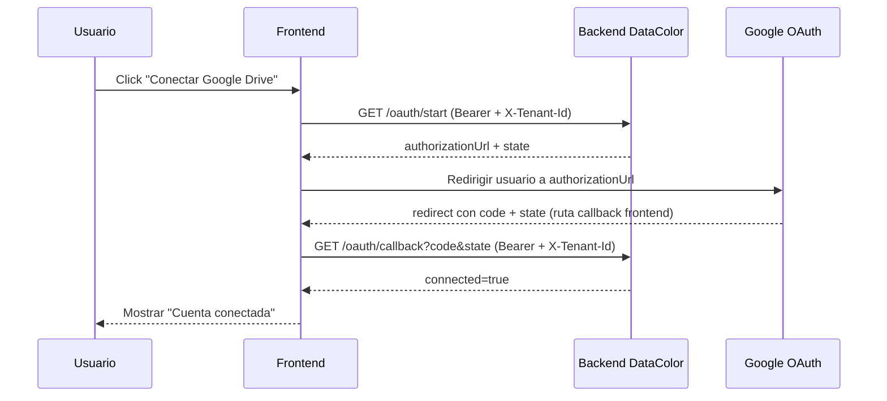

# Guía frontend: integración Google Drive OAuth (Gestor de archivos)

Documento para el equipo frontend sobre cómo implementar UX, estado y llamadas API para conectar Google Drive en DataColor.

---

## 1. Objetivo funcional

- Permitir al usuario conectar su cuenta de Google Drive desde el módulo de gestor de archivos.
- Usar la conexión para habilitar importaciones con `POST /api/integrations/google-drive/import`.
- Mantener seguridad por tenant y usuario autenticado.

---

## 2. Endpoints backend involucrados

| Acción | Endpoint | Auth |
|--------|----------|------|
| Iniciar OAuth | `GET /api/integrations/google-drive/oauth/start` | JWT + `TenantMember` |
| Confirmar callback OAuth | `GET /api/integrations/google-drive/oauth/callback?code=...&state=...` | JWT + `TenantMember` |
| Importar archivo URL externa | `POST /api/integrations/google-drive/import` | JWT + `TenantMember` |

Headers esperados desde frontend:

- `Authorization: Bearer <jwt>`
- `X-Tenant-Id: <tenantIdActivo>`

---

## 3. Flujo recomendado en frontend

---

## 4. Importante: manejo de callback con JWT

Con la implementación actual del backend, `GET /api/integrations/{provider}/oauth/callback` está protegido con `[Authorize]`.

Eso significa que **no conviene** usar como redirección final una URL de backend pura si el JWT solo vive en memoria del SPA, porque Google no enviará el header `Authorization` automáticamente.

### Recomendación práctica

- Configurar una ruta callback en frontend (por ejemplo: `http://localhost:4200/integrations/google/callback`).
- En esa vista:
  - leer `code` y `state` del querystring,
  - llamar al endpoint backend `/oauth/callback` enviando JWT y `X-Tenant-Id`,
  - mostrar éxito o error.

Si se decide mantener callback directo a backend, debe existir un mecanismo alterno de autenticación (por ejemplo cookie auth server-side), que hoy no es el patrón principal del proyecto.

---

## 5. Estados de UI recomendados

- `disconnected`: no hay conexión activa.
- `connecting`: se solicitó `/oauth/start` y se está redirigiendo.
- `verifying_callback`: frontend recibió `code/state` y está llamando `/oauth/callback`.
- `connected`: backend confirmó `connected=true`.
- `error`: fallo de red, auth, tenant o validación de estado.

Mensajes sugeridos:

- "Conectando con Google..."
- "Validando autorización..."
- "Google Drive conectado correctamente."
- "No se pudo completar la conexión. Intenta nuevamente."

---

## 6. Manejo de errores en frontend

Casos habituales:

- `401`: sesión expirada o token inválido.
  - Acción: refrescar token o pedir login.
- `403`: usuario sin acceso al tenant activo o `state` no corresponde al usuario/tenant.
  - Acción: validar tenant seleccionado y volver a iniciar flujo.
- `400`: callback sin `code`, `state` inválido/expirado.
  - Acción: reiniciar `oauth/start`.
- `412` al importar: integración no conectada.
  - Acción: mostrar CTA "Conectar Google Drive".
- `502` en callback: fallo al canjear `code` por token en Google.
  - Acción: permitir reintento completo.

---

## 7. Ejemplo de implementación (SPA)

## 7.1 Botón "Conectar Google Drive"

1. `GET /api/integrations/google-drive/oauth/start`
2. Guardar temporalmente `state` retornado (opcional para debugging UX).
3. `window.location.href = authorizationUrl`

## 7.2 Pantalla callback frontend

1. Leer `code` y `state` del query.
2. Validar presencia de ambos.
3. Llamar:
   - `GET /api/integrations/google-drive/oauth/callback?code=...&state=...`
   - con `Authorization` y `X-Tenant-Id`.
4. Si `connected=true`, redirigir a biblioteca media con toast de éxito.
5. Si falla, mostrar pantalla de error con botón "Reintentar conexión".

---

## 8. Recomendaciones de seguridad frontend

- Nunca loggear `code`, `access_token` ni `refresh_token` en consola.
- Limpiar parámetros `code/state` del URL tras procesar callback (usar `replaceState` o navegación sin query).
- Evitar múltiples clicks en "Conectar" (deshabilitar botón en estado `connecting`).
- No persistir secretos OAuth de Google en frontend.

---

## 9. Checklist de QA manual (frontend)

- Con tenant válido, `oauth/start` devuelve URL y redirige correctamente.
- Callback con `code/state` válidos termina en estado `connected`.
- Callback repetido o vencido muestra error controlado.
- Con token expirado, app redirige a login.
- Con tenant incorrecto, app muestra mensaje de permisos.
- Tras conexión exitosa, `POST /api/integrations/google-drive/import` deja de fallar con `INTEGRATION_NOT_CONNECTED`.

---

## 10. Próximas mejoras recomendadas

- Endpoint `GET /api/integrations/google-drive/status` para pintar estado inicial sin intentar importar.
- Endpoint `POST /api/integrations/google-drive/disconnect`.
- Refresh automático de `access_token` con `refresh_token` desde backend.

