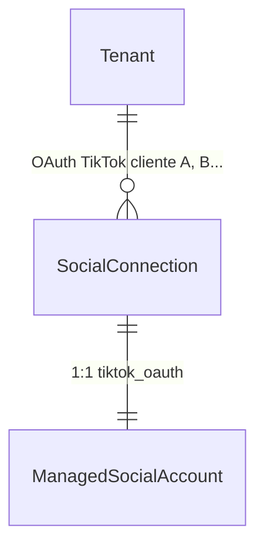
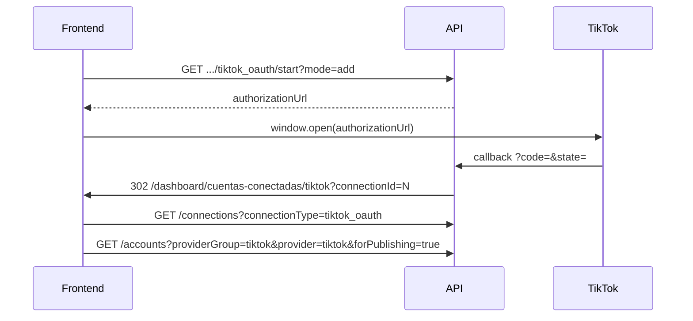

# Guía frontend: Multi-OAuth por tenant (TikTok OAuth)

Documento para el equipo frontend con el flujo backend previsto: varias cuentas TikTok OAuth (`SocialConnection`) por tenant en `tiktok_oauth`, gestión por conexión (sync/disconnect/reauth) y **1 conexión = 1 perfil TikTok** publicable.

**Referencia técnica backend:** [`docs/Documentos requerimientos/plan-tiktok-por-tenant.md`](Documentos%20requerimientos/plan-tiktok-por-tenant.md)  
**Paridad de patrón:** [`docs/frontend-threads-por-tenant.md`](frontend-threads-por-tenant.md), [`docs/frontend-multi-oauth-instagram-por-tenant.md`](frontend-multi-oauth-instagram-por-tenant.md)

**Ruta SPA sugerida:** `/dashboard/cuentas-conectadas/tiktok`

**Estado:** Pendiente de implementación backend

---

## 1. Objetivo funcional

Permitir que un mismo tenant (caso agencia) conecte **varios clientes TikTok** mediante TikTok Login Kit: **1 OAuth = 1 perfil**, **sin** pantalla de selección post-OAuth.

El frontend debe poder:

- Mostrar **cuántas conexiones OAuth** y **cuántos perfiles TikTok activos** hay.
- **Añadir** otro cliente (`mode=add`).
- **Reautenticar** una conexión concreta (`mode=reauth&connectionId=`).
- **Sincronizar** o **desconectar** una conexión específica sin afectar las demás.
- Mostrar cada conexión como tarjeta con `displayLabel` (`@username` o `display_name`).

**TikTok es red independiente** (`providerGroup=tiktok`, `provider=tiktok`). No mezclar con pantallas Meta ni LinkedIn.

---

## 2. Modelo conceptual para la UI



| Concepto | Qué representa en UI | Ejemplo |
|----------|----------------------|---------|
| **SocialConnection** | Sesión OAuth del usuario TikTok | Tarjeta `@marca_cliente_a` |
| **ManagedSocialAccount** | Perfil publicable (misma identidad) | Mismo perfil en composer |

**Regla de identidad:** `SocialConnection.ExternalUserId === ManagedSocialAccount.ExternalAccountId` (valor = `open_id` de TikTok).

**No aplica en v1:** selector post-OAuth, `SocialAccountConnection`, bindings N:M.

---

## 3. Headers comunes

```http
Authorization: Bearer <jwt>
X-Tenant-Id: <tenantIdActivo>
```

Formato: `{ "data": { ... } }` en `camelCase`.

---

## 4. Endpoints (`tiktok_oauth`)

| Acción | Método | Ruta |
|--------|--------|------|
| Status | `GET` | `/api/social/integrations/tiktok/tiktok_oauth/status` |
| Listar conexiones | `GET` | `/api/social/connections?connectionType=tiktok_oauth` |
| Detalle conexión | `GET` | `/api/social/connections/{connectionId}` |
| Iniciar OAuth (add) | `GET` | `/api/social/connect/tiktok/tiktok_oauth/start?mode=add` |
| Iniciar OAuth (reauth) | `GET` | `/api/social/connect/tiktok/tiktok_oauth/start?mode=reauth&connectionId={id}` |
| Callback OAuth | `GET` | `/api/social/connect/tiktok/tiktok_oauth/callback` |
| Sync scoped | `POST` | `/api/social/connections/{connectionId}/sync` |
| Disconnect scoped | `POST` | `/api/social/connections/{connectionId}/disconnect` |
| Cuentas TikTok | `GET` | `/api/social/accounts?providerGroup=tiktok&provider=tiktok` |
| Publicables | `GET` | `/api/social/accounts?providerGroup=tiktok&provider=tiktok&forPublishing=true` |
| Opciones de publicación (composer) | `GET` | `/api/social/accounts/{managedSocialAccountId}/publishing-options` |
| Publicar | `POST` | `/api/social/post-plans` |

> **Callback OAuth:** el frontend **no** llama `GET .../tiktok_oauth/callback` directamente. Tras autorizar, **TikTok redirige al backend** con `code` y `state`; la API procesa el OAuth y luego redirige al SPA (`FrontendOAuthSuccessRedirectPath`).

### 4.1 Status — campos relevantes

```json
{
  "data": {
    "providerGroup": "tiktok",
    "connectionType": "tiktok_oauth",
    "connected": true,
    "connectionCount": 3,
    "allowMultipleConnectionsPerTenant": true,
    "maxConnectionsPerTenant": 5,
    "remainingConnections": 2,
    "maxTikTokAccounts": 5,
    "activeTikTokAccounts": 3,
    "remainingTikTokAccounts": 2,
    "totalAccounts": 3,
    "activeAccounts": 3,
    "requiresReconnect": false
  }
}
```

| Campo | Uso en UI |
|-------|-----------|
| `connectionCount` / `maxConnectionsPerTenant` / `remainingConnections` | Badge OAuth “3/5 conexiones TikTok” |
| `activeTikTokAccounts` / `maxTikTokAccounts` / `remainingTikTokAccounts` | Badge plan “3/5 perfiles publicables” |
| `allowMultipleConnectionsPerTenant` | Mostrar “Conectar otro perfil” |

### 4.2 Regla para deshabilitar “Conectar TikTok”

```text
canAddTikTok =
  allowMultipleConnectionsPerTenant == true
  AND (remainingConnections == null OR remainingConnections > 0)
  AND (remainingTikTokAccounts == null OR remainingTikTokAccounts > 0)
```

| Condición | UI |
|-----------|-----|
| `remainingConnections <= 0` | Toast “Límite de conexiones TikTok alcanzado” |
| `remainingTikTokAccounts <= 0` | Toast “Límite de cuentas TikTok activas alcanzado” |

---

## 5. Flujo OAuth (sin selector)



**Tras OAuth exitoso:** no hay pantalla de selección. Ir directo a listado de conexiones o detalle de la conexión creada.

**Reauth:** botón “Reconectar” en tarjeta → `start?mode=reauth&connectionId={id}`. Si el usuario inicia sesión con **otra** cuenta TikTok → `409 SOCIAL_CONNECTION_REAUTH_USER_MISMATCH`.

---

## 6. Pantalla sugerida `/dashboard/cuentas-conectadas/tiktok`


### Secciones

1. **Header + status** — badges de cupo OAuth y cuentas activas desde `GET .../tiktok_oauth/status`.
2. **Botón “Conectar TikTok”** — visible si `canAddTikTok`; abre OAuth add.
3. **Lista de conexiones** — `GET /api/social/connections?connectionType=tiktok_oauth`:
   - `displayLabel`, `tokenStatus`, `lastSyncAt`
   - Acciones: Sync, Reconectar (reauth), Desconectar
4. **Perfiles publicables** (opcional en misma vista o composer) — `GET /api/social/accounts?providerGroup=tiktok&provider=tiktok&forPublishing=true`.

### Tarjeta de conexión (ejemplo)

| Campo API | UI |
|-----------|-----|
| `displayLabel` | Título `@username` |
| `tokenStatus` | Chip según tabla §6.1 |
| `lastSyncAt` | “Última sync: …” |
| `id` | Para reauth/disconnect/sync |

### 6.1 Estados visuales — `tokenStatus`

Mapeo canónico para el chip de la tarjeta de conexión (y filas de cuenta si aplica). Valores en **PascalCase** como llegan del API (`tokenStatus` string).

| `tokenStatus` | UI (chip / etiqueta) | Acción sugerida |
|---------------|----------------------|-----------------|
| `Valid` | Conectado | Sync, publicar |
| `Expired` | Requiere reconexión | Botón **Reconectar** (`mode=reauth`) |
| `Revoked` | Desconectado | Botón **Conectar** de nuevo (`mode=add`) o quitar tarjeta |
| `Invalid` | Error de conexión | Reconectar; mostrar `lastSyncError` si existe |
| `RefreshFailed` | Requiere reconexión | Reconectar; token refresh falló en backend |

**Notas:**

- `RefreshFailed` puede exponerse como `tokenStatus` explícito o inferirse de `requiresReconnect === true` + código de error de refresh en detalle de conexión — unificar en UI como “Requiere reconexión”.
- Si llega `Unknown` (aún no validado), mostrar **Pendiente de validación** y ofrecer Sync.
- Colores sugeridos: `Valid` → success; `Expired` / `RefreshFailed` → warning; `Revoked` → neutral; `Invalid` → error.

---

## 7. Composer / publicación

### Destinos

Filtrar cuentas con `GET /api/social/accounts?providerGroup=tiktok&provider=tiktok&forPublishing=true`.

### Capabilities (previsto)

| Capability | MVP | Notas |
|------------|-----|-------|
| `canPublishVideo` | Sí | Requiere video en el plan |
| `canPublishCaption` | Sí | El `Message` del plan se envía como caption/descripción del video |
| `canPublishTextOnly` | No | No hay post solo texto sin video |
| `canPublishImage` | No v1 | Imagen estática sin video — fase posterior |

**UI:** el composer debe seguir mostrando el campo de texto/caption para destinos TikTok; no ocultarlo por `canPublishTextOnly = false`.

### Publishing options (TikTok / creator info)

Antes de publicar — o al abrir el composer con al menos un destino TikTok — el frontend debe consultar las **opciones de publicación** de la cuenta vía el endpoint **genérico social-first** (no llamar a TikTok directamente desde el SPA):

```http
GET /api/social/accounts/{managedSocialAccountId}/publishing-options
Authorization: Bearer <jwt>
X-Tenant-Id: <tenantId>
```

El backend resuelve el `provider` de la cuenta y devuelve un payload específico por red. Para TikTok, la respuesta incluye creator info (privacidad, duración, duet/stitch/comments). Mismo patrón reutilizable luego para YouTube, Pinterest, X, LinkedIn, etc.

**Ejemplo respuesta TikTok (ilustrativo):**

```json
{
  "data": {
    "provider": "tiktok",
    "tiktok": {
      "privacyLevelOptions": ["PUBLIC_TO_EVERYONE", "MUTUAL_FOLLOW_FRIENDS"],
      "maxVideoPostDurationSec": 600,
      "commentDisabled": false,
      "duetDisabled": false,
      "stitchDisabled": false
    }
  }
}
```

**Cuándo llamar:** al seleccionar cuenta TikTok en el composer, o al expandir opciones avanzadas de ese destino. Cachear en sesión del borrador unos minutos; refrescar si el usuario cambia de cuenta TikTok.

**Campos esperados en `data.tiktok`:**

| Campo | Uso en UI |
|-------|-----------|
| `privacyLevelOptions` | Select de privacidad — **solo valores devueltos por API** |
| `maxVideoPostDurationSec` | Validar duración del video antes de enviar |
| `commentDisabled` | Default / toggle comentarios si la API lo permite |
| `duetDisabled` | Default / toggle duet |
| `stitchDisabled` | Default / toggle stitch |

**Reglas UI:**

- **No quemar** valores de `privacy_level` (p. ej. `PUBLIC_TO_EVERYONE`) — dependen del creador y de la app.
- Si `publishing-options` falla, mostrar aviso y deshabilitar publicación a TikTok para esa cuenta (o ofrecer reintentar).
- Enviar la elección del usuario en `providerOptions.tiktok` del `PostPlan` (ver plan backend §8.4.2).

Ejemplo de payload al crear plan (fragmento):

```json
{
  "message": "Caption del video",
  "mediaId": 42,
  "destinations": [{ "managedSocialAccountId": 101 }],
  "providerOptions": {
    "tiktok": {
      "privacyLevel": "<valor de privacyLevelOptions>",
      "disableComment": false,
      "disableDuet": false,
      "disableStitch": false
    }
  }
}
```

### Crear plan

```http
POST /api/social/post-plans
```

**Planes multi-red (social-first):**

- TikTok **puede** compartir plan con destinos Meta, LinkedIn u otras redes (mismo contenido, varias redes — patrón Hootsuite/Agorapulse).
- El backend valida **compatibilidad por destino**, no bloquea el plan entero por un solo target incompatible.
- Si un `PostTarget` es `provider=tiktok`, ese destino **requiere video válido** (`MediaId` o `PlanMedia` con rol video).
- Si otro destino no soporta el mismo media/caption (p. ej. solo texto para Threads, imagen para Instagram), el backend devuelve error **por ese destino** (`PostTarget` omitido o `Failed` con `errorCode` específico), no necesariamente rechaza todo el `PostPlan`.

**UI composer:**

- Permitir seleccionar TikTok junto con otras redes en el mismo borrador.
- Si el usuario añade TikTok sin video, advertir **antes** de enviar o mostrar error por destino tras crear el plan.
- Mostrar estado por target en polling (`Published` / `Failed` / `Skipped` por red).

Polling: `GET /api/social/post-plans/{planId}` o `GET /api/social/post-targets/{id}/publish-attempts`.

---

## 8. Errores a manejar

| Código HTTP | `errorCode` | Cuándo | Acción UI |
|-------------|-------------|--------|-----------|
| 409 | `SOCIAL_CONNECTION_LIMIT_REACHED` | Cupo OAuth lleno en add | Toast + deshabilitar “Conectar” |
| 409 | `SOCIAL_TIKTOK_ACCOUNT_LIMIT_REACHED` | Cupo cuentas lleno | Toast + deshabilitar “Conectar” |
| 409 | `SOCIAL_CONNECTION_REAUTH_USER_MISMATCH` | Reauth con otra cuenta | Modal: “Inicia sesión con la cuenta correcta” |
| 400 | `TIKTOK_VIDEO_REQUIRED` | Target TikTok sin video en el plan | Advertir en composer o error por destino |
| 400 | Errores por destino (otras redes) | Media/caption incompatible con un target concreto | Mostrar fallo solo en esa fila del plan |
| 400 | OAuth no configurado | App sin credenciales | Mensaje admin |

---

## 9. Diferencias vs otras redes (UI)

| | Instagram | Threads | TikTok |
|--|-----------|---------|--------|
| `providerGroup` | `meta` | `meta` | **`tiktok`** |
| `connectionType` | `instagram_login` | `threads_login` | **`tiktok_oauth`** |
| Selector post-OAuth | No | No | **No** |
| Ruta SPA | `/cuentas-conectadas/instagram` | `/cuentas-conectadas/threads` | **`/cuentas-conectadas/tiktok`** |
| Contenido publish | Imagen/video/carousel | Texto/imagen | **Video + caption** |
| OAuth host | Meta / Instagram | threads.net | **tiktok.com** |

---

## 10. Configuración TikTok Developer (referencia)

En [TikTok for Developers](https://developers.tiktok.com/):

| Campo portal | Valor |
|--------------|-------|
| Redirect URI | `https://<API_HOST>/api/social/connect/tiktok/tiktok_oauth/callback` |
| Scopes | `user.info.basic`, `video.upload`, `video.publish` |
| Login Kit | Web habilitado |

**Local dev:** `https://localhost:7075/api/social/connect/tiktok/tiktok_oauth/callback`

---

## 11. Checklist implementación frontend

- [x] Ruta `/dashboard/cuentas-conectadas/tiktok`
- [x] Consumir `GET .../tiktok_oauth/status` con cupos explícitos
- [x] Listado conexiones `connectionType=tiktok_oauth`
- [x] OAuth add / reauth / disconnect / sync por `connectionId`
- [x] Manejo errores 409 (límites + reauth mismatch)
- [ ] Composer: destinos `provider=tiktok` con video + caption _(pendiente — fuera de alcance v1)_
- [ ] `GET .../accounts/{id}/publishing-options` al abrir opciones TikTok; leer `data.tiktok.privacyLevelOptions` _(pendiente — composer)_
- [ ] Enviar `providerOptions.tiktok` sin valores de privacidad hardcodeados _(pendiente — composer)_
- [x] No reutilizar pantalla Instagram/Threads/LinkedIn tal cual

---

**Estado backend:** Pendiente — ver [`plan-tiktok-por-tenant.md`](Documentos%20requerimientos/plan-tiktok-por-tenant.md)
