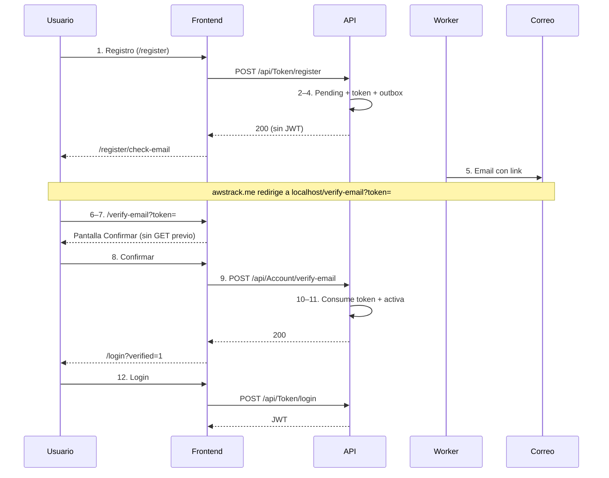

# Flujo de verificación de email — Estado de implementación

Documento de seguimiento para el registro con confirmación por correo. Resume qué pasos del flujo ya están cubiertos y qué falta, según el **frontend** de este repositorio y la **documentación de API** disponible (`api.md`, `POST-api-token-login.md`, `GET-api-invitations-validate.md`).

> **Alcance de esta revisión:** el backend (DataColor.Api) no vive en este repo. Los pasos 2–5 y 10–11 se marcan como *no verificados aquí* salvo que exista evidencia en la documentación o en el contrato expuesto al front.

---

## 1. Resumen ejecutivo

| Estado | Cantidad | Pasos / ámbito |
|--------|----------|----------------|
| ✅ Implementado (frontend) | 6 | 1, 6, 7, 8, 9, 12 |
| ✅ Extra (no numerado en flujo original) | 1 | Reenvío de correo (`resend-verification`) |
| ❓ Sin evidencia en este repo (API / worker) | 6 | 2, 3, 4, 5, 10, 11 |

**Conclusión:** el front cubre el flujo completo del lado cliente: **registro** → **“Revisa tu correo”** → **verificación por enlace** (`/verify-email`) → **reenvío** → **login** (con `email_not_verified` y `?verified=1`). Los pasos de backend/worker (2–5, 10–11) dependen de DataColor.Api y no se pueden validar desde este repo.

---

## 2. Tabla paso a paso

| # | Paso | Frontend | API / Worker | Notas |
|---|------|----------|--------------|-------|
| 1 | Usuario se registra | ✅ | ⚠️ | `/register` → `POST /api/Token/register` → `/register/check-email` |
| 2 | API crea usuario en `PendingEmailVerification` | — | ❓ | No documentado en `api.md` |
| 3 | API genera `SecurityToken` | — | ❓ | Patrón similar en invitaciones |
| 4 | API encola `EmailOutbox` | — | ❓ | Sin evidencia en este repositorio |
| 5 | Worker envía correo con link | — | ❓ | Sin evidencia en este repositorio |
| 6 | Usuario abre link en el navegador | ✅ | — | `/verify-email?token=` (solo lee query param; no parsea `awstrack.me`) |
| 7 | Frontend muestra pantalla de confirmación | ✅ | — | `VerifyEmailComponent` — “Confirma tu correo” |
| 8 | Usuario presiona **Confirmar** | ✅ | — | No auto-confirma al cargar la página |
| 9 | Frontend llama verificación | ✅ | ⚠️ | `POST /api/Account/verify-email` con `{ "token": "..." }` |
| 10 | API consume token | — | ❓ | Lógica en backend |
| 11 | API activa usuario | — | ❓ | Login debe permitir acceso tras verificar |
| 12 | Usuario inicia sesión | ✅ | ✅ | `/login` → `POST /api/Token/login` |

**Leyenda:** ✅ listo · ⚠️ parcial / depende del backend · ❌ pendiente · ❓ no verificado en este repo · — no aplica a esa capa

---

## 3. Detalle por paso

### Paso 1 — Usuario se registra ✅ (frontend)

**Endpoint:** `POST /api/Token/register` (equivalente a `/api/token/register`).

**Body (`RegisterDto`):**

```json
{
  "firstName": "WILLIAM",
  "lastName": "AVILA ROMERO",
  "email": "wrar2014@gmail.com",
  "password": "Elpoeta123",
  "telephone": "3024564756",
  "rol": "usuario",
  "tenantName": "Dataifx"
}
```

| Campo | Validación en front |
|-------|---------------------|
| `firstName`, `lastName` | Requeridos, máx. 50 caracteres |
| `email` | Requerido, formato email |
| `password` | Requerido, mín. 6 caracteres |
| `telephone` | Requerido (el formulario lo exige; no estaba en el DTO de ejemplo del backend) |
| `rol` | Fijo `"usuario"` en el formulario público (`"administrador"` no se ofrece en UI) |
| `tenantName` | Opcional; solo se envía si el usuario lo completa |

**Respuesta exitosa (200):** no incluye JWT. El front usa `data.email` para la pantalla de confirmación.

**Comportamiento del front tras registro:**

- No guarda JWT (`setAuthData` no se invoca).
- No redirige al dashboard.
- Navega a `/register/check-email?email=...` (“Revisa tu correo”).
- **409:** mensaje de email ya registrado.

**Archivos:**

- `src/app/features/auth/components/register.component.ts`
- `src/app/features/auth/components/register-check-email.component.ts`
- `src/app/core/services/auth.service.ts`
- `src/app/core/models/auth.model.ts` (`RegisterRequest`, `RegisterResponse`)

---

### Pasos 2–5 — Backend: estado, token, outbox y correo ❓

| Paso | Qué debería ocurrir | Evidencia en este repo |
|------|---------------------|-------------------------|
| 2 | Usuario creado con estado `PendingEmailVerification` | No en `api.md` ni modelos del front |
| 3 | `SecurityToken` con propósito verificación de email | No documentado aquí |
| 4 | Registro en `EmailOutbox` | Sin referencia |
| 5 | Worker envía email con `http://localhost:4200/verify-email?token=...` | Sin referencia |

**Referencia de patrón (invitaciones):** `accept-invitation` + `GET /api/invitations/validate` — el flujo de email **no** usa GET de validación previa; solo POST al confirmar.

**Pendiente en backend (confirmar en DataColor.Api):**

- [ ] Estado `PendingEmailVerification` en `POST /api/Token/register`
- [ ] `SecurityToken` + expiración
- [ ] `EmailOutbox` + worker de envío
- [ ] Documentar en Swagger/`api.md`: `verify-email` y `resend-verification`

---

### Pasos 6–9 — Frontend de verificación ✅

| Paso | Estado | Implementación |
|------|--------|----------------|
| 6 | ✅ | Ruta `verify-email` en `app.routes.ts` |
| 7 | ✅ | `VerifyEmailComponent` — si falta `token` → “Enlace inválido” + reenvío |
| 8 | ✅ | Botón **Confirmar** con estado `confirming` |
| 9 | ✅ | `AuthService.verifyEmail()` → `POST /api/Account/verify-email` |

**Contrato usado por el front:**

```http
POST /api/Account/verify-email
Content-Type: application/json

{ "token": "<valor del query param token>" }
```

| Respuesta | Comportamiento en front |
|-----------|-------------------------|
| **200** `{ "message": "Correo verificado" }` | Redirige a `/login?verified=1` |
| **400** `{ "message": "Token inválido o expirado" }` | Muestra error (`extractErrorMessage`) + formulario de reenvío |

**Lo que el front NO hace (diferencia vs invitaciones):**

- No llama `GET` de validación al abrir la URL.
- No verifica el token hasta que el usuario pulsa **Confirmar**.

**Reenvío de correo** (`POST /api/Account/resend-verification` con `{ "email": "..." }`):

| Pantalla | Uso |
|----------|-----|
| `/register/check-email?email=...` | Botón “Reenviar correo de verificación” |
| `/verify-email` (error o sin token) | Campo email + “Reenviar correo” |
| `/login` (403 `email_not_verified`) | Botón → `/register/check-email?email=...` |

**Archivos:**

- `src/app/features/auth/components/verify-email.component.ts|html|scss`
- `src/app/core/services/auth.service.ts` (`verifyEmail`, `resendVerification`)
- `src/app/core/interceptors/auth.interceptor.ts` — rutas públicas
- `src/app/core/interceptors/tenant.interceptor.ts` — sin `X-Tenant-Id` en verify/resend

---

### Pasos 10–11 — API: consumir token y activar usuario ❓

**Evidencia en este repo:**

- `api.md` solo lista bajo **Account**: `change-password`. **No** documenta `verify-email` ni `resend-verification`.
- `POST-api-token-login.md` documenta **403** por usuario inactivo; el front además espera `detail: "email_not_verified"` para cuentas sin verificar.

**Pendiente en API:**

- [ ] `POST /api/Account/verify-email` — `[AllowAnonymous]`, consumo único del token
- [ ] Activación de usuario tras verificación
- [ ] Login con **403** y `detail: "email_not_verified"` si intentan entrar antes de verificar
- [ ] `POST /api/Account/resend-verification`

---

### Paso 12 — Usuario inicia sesión ✅

**Implementado:**

- `LoginComponent` → `POST /api/Token/login`
- **403** + `error.error.detail === 'email_not_verified'` → mensaje + enlace a reenvío
- **`?verified=1`** → banner “¡Correo verificado! Tu cuenta está activa…”

**Archivos:** `login.component.ts`, `login.component.html`

---

## 4. Diagrama del flujo (estado real del front)



---

## 5. Checklist de cierre

### Frontend (este repositorio)

- [x] Pantalla post-registro: “Revisa tu correo” (`/register/check-email`)
- [x] Ruta `/verify-email?token=`
- [x] `POST /api/Account/verify-email`
- [x] `POST /api/Account/resend-verification`
- [x] Login: `email_not_verified` y `?verified=1`
- [x] Errores 400/409 con mensaje al usuario (genérico vía `extractErrorMessage`)
- [ ] Mensajes diferenciados por código (expirado vs ya usado vs inválido) — hoy un solo fallback
- [ ] Tests E2E o manuales documentados en QA

### API (DataColor.Api — fuera de este repo)

- [ ] Registro → `PendingEmailVerification`
- [ ] `SecurityToken` + `EmailOutbox` + worker
- [ ] Endpoints Account en Swagger y `api.md`
- [ ] Login **403** con `detail: "email_not_verified"`

### Operaciones

- [ ] URL base del front en config del worker (`/verify-email?token=`)
- [ ] Plantilla de correo y SMTP/Resend en producción

---

## 6. Referencias en el código

| Área | Referencia |
|------|------------|
| Registro | `register.component.ts`, `register-check-email.component.ts` |
| Verificación | `verify-email.component.ts`, `AuthService.verifyEmail()` |
| Reenvío | `register-check-email.component.ts`, `verify-email.component.ts`, `AuthService.resendVerification()` |
| Login | `login.component.ts` |
| Invitaciones (patrón similar) | `accept-invitation.component.ts`, `invitation.service.ts` |
| Rutas | `app.routes.ts` — `/login`, `/register`, `/register/check-email`, `/verify-email`, `/accept-invitation` |
| Interceptores | `auth.interceptor.ts`, `tenant.interceptor.ts` |
| `api.md` local | Solo `change-password` bajo Account; verify/resend **no** listados aún |

---

## 7. Verificación cruzada (última revisión)

| Afirmación del doc | ¿Coincide con el código? |
|--------------------|---------------------------|
| Paso 1 validaciones (50 chars, pass 6+) | ✅ `register.component.ts` |
| No JWT tras registro | ✅ |
| `/verify-email` existe | ✅ `app.routes.ts` L23–25 |
| POST `/api/Account/verify-email` | ✅ `auth.service.ts` L27–28 |
| POST `/api/Account/resend-verification` | ✅ `auth.service.ts` L31–32 |
| Rutas públicas en interceptores | ✅ |
| Login `verified=1` | ✅ `login.component.ts` L51 |
| Login `email_not_verified` | ✅ `login.component.ts` L131 |
| GET validación token al abrir link | ❌ No implementado (por diseño) |
| `api.md` incluye verify-email | ❌ Sigue desactualizado |

---

*Última revisión: 5 de julio de 2026 — verificada contra el repositorio `publicador-social` (frontend Angular).*
