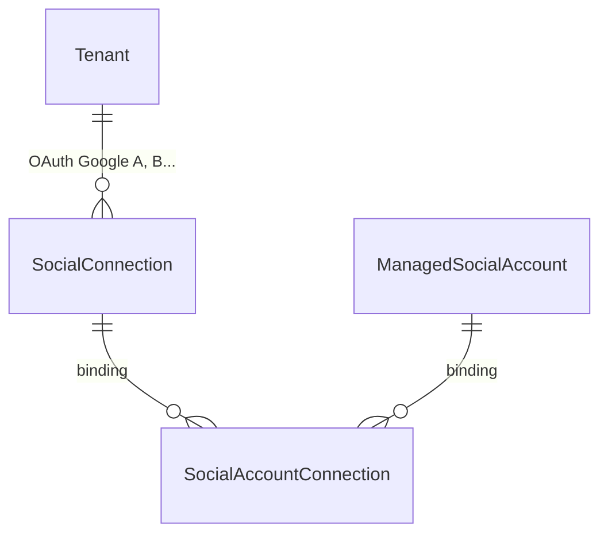

# Guía frontend: YouTube por tenant (`youtube_oauth`)

Documento para el equipo SPA: multi-OAuth Google por tenant, **selector de canales** post-OAuth (paridad LinkedIn/Facebook), bindings N:M, publish de video con opciones YouTube.

**Referencia backend:** [`docs/Documentos requerimientos/plan-youtube-por-tenant.md`](Documentos%20requerimientos/plan-youtube-por-tenant.md)  
**Patrón selector:** [`docs/frontend-seleccion-paginas-facebook-post-oauth.md`](frontend-seleccion-paginas-facebook-post-oauth.md), [`docs/frontend-multi-oauth-linkedin-por-tenant.md`](frontend-multi-oauth-linkedin-por-tenant.md)  
**Composer video:** [`docs/frontend-tiktok-por-tenant.md`](frontend-tiktok-por-tenant.md) (solo bloque video + `providerOptions`)

**Rutas SPA sugeridas:**
- `/dashboard/cuentas-conectadas/youtube` — conexiones Google y canales conectados
- `/dashboard/cuentas-conectadas/youtube/select?connectionId={id}` — selector post-OAuth

**Estado:** Backend implementado (`youtube_oauth`)

---

## 1. Objetivo funcional

Permitir que un tenant conecte **varias cuentas Google** (clientes distintos). Cada OAuth:

1. Autoriza scopes YouTube (`youtube.readonly`, `youtube.upload`).
2. Sincroniza **todos los canales** del usuario como `Discovered` (por defecto).
3. Redirige al **selector** para elegir qué canales activar en el workspace (consume cupo comercial).

El frontend debe:

- Redirigir al selector tras OAuth exitoso.
- Diferenciar **conexión Google** (OAuth) vs **canal YouTube** (recurso publicable).
- Soportar **multi-OAuth** (`mode=add`) y **reauth** (`mode=reauth&connectionId=`).
- Mostrar cupos de **conexiones OAuth** y de **canales conectados** por separado.
- Composer: video obligatorio + **`providerOptions.youtube.title` obligatorio** (no usar `message` como título).

**Identidad cerrada:**

| Campo | Valor |
|-------|-------|
| `providerGroup` | `google` |
| `provider` | `youtube` |
| `connectionType` | `youtube_oauth` |
| `accountType` | `channel` |

---

## 2. Modelo conceptual



| Concepto | UI | Ejemplo |
|----------|-----|---------|
| **SocialConnection** | Tarjeta cuenta Google | `user@gmail.com`, `externalUserId` = `google_sub` |
| **ManagedSocialAccount** | Fila canal YouTube | `Mi Canal`, `externalAccountId` = `UCxxxx` |
| **SocialAccountConnection** | Enlace canal↔OAuth | Mismo canal desde 2 Google si ambos lo administran |

**Token:** el access/refresh token vive en **`SocialConnection`**. El binding tiene `encryptedResourceAccessToken = null`.

**Disconnect conexión:** revoca bindings de esa conexión; si el canal tiene otro binding activo, **sigue conectado** vía la otra conexión.

---

## 3. Headers comunes

```http
Authorization: Bearer <jwt>
X-Tenant-Id: <tenantIdActivo>
```

Respuestas: `{ "data": { ... } }` en `camelCase`.

---

## 4. Endpoints (`youtube_oauth`)

Base: `providerGroup=google`, `connectionType=youtube_oauth`, `provider=youtube`.

| Acción | Método | Ruta |
|--------|--------|------|
| Status | `GET` | `/api/social/integrations/google/youtube_oauth/status` |
| Listar conexiones | `GET` | `/api/social/connections?connectionType=youtube_oauth` |
| Detalle conexión | `GET` | `/api/social/connections/{connectionId}` |
| OAuth add | `GET` | `/api/social/connect/google/youtube_oauth/start?mode=add` |
| OAuth reauth | `GET` | `/api/social/connect/google/youtube_oauth/start?mode=reauth&connectionId={id}` |
| Callback OAuth | `GET` | `/api/social/connect/google/youtube_oauth/callback` |
| Cuentas del selector | `GET` | `/api/social/connections/{connectionId}/accounts?status=available` |
| Conectar canal | `POST` | `/api/social/accounts/{accountId}/connect` |
| Desconectar canal | `POST` | `/api/social/accounts/{accountId}/disconnect` |
| Sync conexión | `POST` | `/api/social/connections/{connectionId}/sync` |
| Disconnect conexión | `POST` | `/api/social/connections/{connectionId}/disconnect` |
| Canales (todos) | `GET` | `/api/social/accounts?providerGroup=google&provider=youtube` |
| Publicables | `GET` | `/api/social/accounts?providerGroup=google&provider=youtube&forPublishing=true` |
| Publishing options | `GET` | `/api/social/accounts/{id}/publishing-options` |
| Publicar | `POST` | `/api/social/post-plans` |

> El callback lo invoca **Google** → backend → redirect SPA. No llamar el callback desde el SPA.

### Redirects post-OAuth (config backend)

| Resultado | URL SPA |
|-----------|---------|
| Éxito | `/dashboard/cuentas-conectadas/youtube/select?connectionId={id}&accountsImported=N` |
| Error | `/dashboard/cuentas-conectadas/youtube?youtubeError={errorCode}` |

---

## 5. Flujos UX

### 5.1 Añadir conexión Google

1. Comprobar `canAddYouTube` en status (solo `remainingConnections > 0`).
2. `GET .../start?mode=add` → redirigir a `authorizationUrl` (Google con `access_type=offline`, `prompt=consent`).
3. Tras callback, SPA en `/youtube/select?connectionId=`.
4. `GET .../connections/{id}/accounts?status=available` → listar canales `Discovered`.

### 5.2 Selector de canales

Por cada fila del selector:

| Campo API | Uso UI |
|-----------|--------|
| `canConnect` | Habilitar botón "Conectar" |
| `remainingSlots` | Cupo global de canales |
| `workspaceStatus` | `discovered` / `connected` |

`POST /api/social/accounts/{id}/connect` → canal pasa a `Connected` y aparece en `forPublishing=true`.

Sin cupo: **409** `YOUTUBE_CHANNEL_LIMIT_REACHED`.

### 5.3 Reauth

1. Desde tarjeta conexión: `start?mode=reauth&connectionId={id}`.
2. Google debe devolver `refresh_token` en add o si no había refresh previo; si falla → `youtubeError=GOOGLE_REFRESH_TOKEN_MISSING`.

### 5.4 Desconectar canal vs conexión

- **Canal:** `POST .../accounts/{id}/disconnect` — solo quita del workspace; no revoca OAuth Google.
- **Conexión:** `POST .../connections/{id}/disconnect` — revoca OAuth; actualiza bindings; canales compartidos pueden seguir activos vía otra conexión.

---

## 6. Reglas UI: `canAddYouTube` vs `canConnectChannel`

| Flag | Significado | Cuándo usar |
|------|-------------|-------------|
| **`canAddYouTube`** | Hay cupo para **nueva conexión OAuth** | Botón "Conectar cuenta Google" |
| **`canConnect` / `remainingYouTubeChannels`** | Hay cupo para **activar canal** | Botón "Conectar canal" en selector |

**Importante:** con `remainingYouTubeChannels = 0` pero `remainingConnections > 0`, **sí** permitir nuevo OAuth; el selector mostrará `canConnect=false` en cada fila hasta liberar cupo.

Status (`GET .../youtube_oauth/status`):

```json
{
  "connectionCount": 1,
  "maxConnectionsPerTenant": 3,
  "remainingConnections": 2,
  "maxYouTubeChannels": 5,
  "activeYouTubeChannels": 5,
  "remainingYouTubeChannels": 0,
  "canAddYouTube": true
}
```

---

## 7. Composer y `providerOptions.youtube`

YouTube **requiere video**. El título **no** se infiere de `message`.

```json
{
  "message": "Descripción por defecto si no hay description en youtube",
  "scheduledAt": "2026-07-01T15:00:00Z",
  "accountIds": [42],
  "planMedia": [{ "composerMediaId": 100, "sortOrder": 0 }],
  "providerOptions": {
    "youtube": {
      "title": "Título obligatorio del video",
      "description": "Opcional; fallback a message",
      "privacyStatus": "private",
      "tags": ["tag1", "tag2"],
      "categoryId": "22",
      "madeForKids": false
    }
  }
}
```

| Campo | Obligatorio | Notas |
|-------|-------------|-------|
| `title` | **Sí** | Máx ~100 caracteres |
| `description` | No | Si falta, backend usa `message` |
| `privacyStatus` | No | `public`, `unlisted`, `private` (default `private`) |
| `tags` | No | |
| `categoryId` | No | Ver publishing-options |
| `madeForKids` | No | COPPA |

Errores publish: `YOUTUBE_VIDEO_REQUIRED`, `YOUTUBE_TITLE_REQUIRED`, `YOUTUBE_UPLOAD_FAILED`.

---

## 8. `GET .../publishing-options`

Respuesta (ejemplo):

```json
{
  "provider": "youtube",
  "youtube": {
    "privacyLevelOptions": ["public", "unlisted", "private"],
    "defaultPrivacyStatus": "private",
    "maxTitleLength": 100,
    "categories": [
      { "id": "22", "name": "People & Blogs" }
    ]
  }
}
```

Usar para poblar selects del composer.

---

## 9. Errores OAuth y operación

| Código | Cuándo | Acción UI |
|--------|--------|-----------|
| `GOOGLE_REFRESH_TOKEN_MISSING` | Add/reauth sin refresh y sin refresh previo | Mensaje + botón reintentar OAuth |
| `SOCIAL_CONNECTION_REAUTH_USER_MISMATCH` | Reauth con otra cuenta Google | Error claro, no mezclar conexiones |
| `YOUTUBE_CHANNEL_LIMIT_REACHED` | Connect sin cupo canal | Upsell / desconectar otro canal |
| `SYNC_NO_CHANNELS_RETURNED` | Google sin canal YouTube | Warning post-OAuth; selector vacío |
| `youtubeError` (query) | Redirect error OAuth | Leer de URL y mostrar banner |

---

## 10. Google Cloud Console (dev local)

1. Proyecto Google Cloud + **YouTube Data API v3** habilitada.
2. Credenciales OAuth 2.0 (Web).
3. Redirect URI = `YouTubeOAuth:RedirectUri` (ej. `https://localhost:7075/api/social/connect/google/youtube_oauth/callback`).
4. Scopes en pantalla de consentimiento: `youtube.readonly`, `youtube.upload`, `openid`, `profile`, `email`.
5. Usuarios de prueba en modo Testing.
6. **No** usar service account para upload de usuario.

---

## 11. Checklist implementación frontend

- [x] Pantalla `/youtube` con listado conexiones + canales conectados
- [x] Botón add Google condicionado a `canAddYouTube`
- [x] Ruta `/youtube/select` post-OAuth con `connectionId`
- [x] Selector: filas canal, `canConnect`, connect/disconnect
- [x] Manejo query `youtubeError` y `warning`
- [ ] Composer: bloque YouTube con título obligatorio + video
- [ ] Integrar `publishing-options` (privacidad, categorías)
- [x] Query publicables: `providerGroup=google&provider=youtube&forPublishing=true`
- [x] Reauth por tarjeta conexión
- [x] Disconnect scoped (canal vs conexión)
- [x] No mezclar con Google Drive (`google_oauth` de archivos)

---

## 12. Capabilities (`capabilities` en cuenta)

| Flag | Significado |
|------|-------------|
| `canPublishVideo` | Puede subir video |
| `canPublishTitle` | Título en composer |
| `canPublishDescription` | Descripción |
| `canPublishTags` | Tags |
| `canPublishThumbnail` | Fase 2 (MVP puede ser false) |

No usar `canPublishCaption` (no aplica a YouTube).
