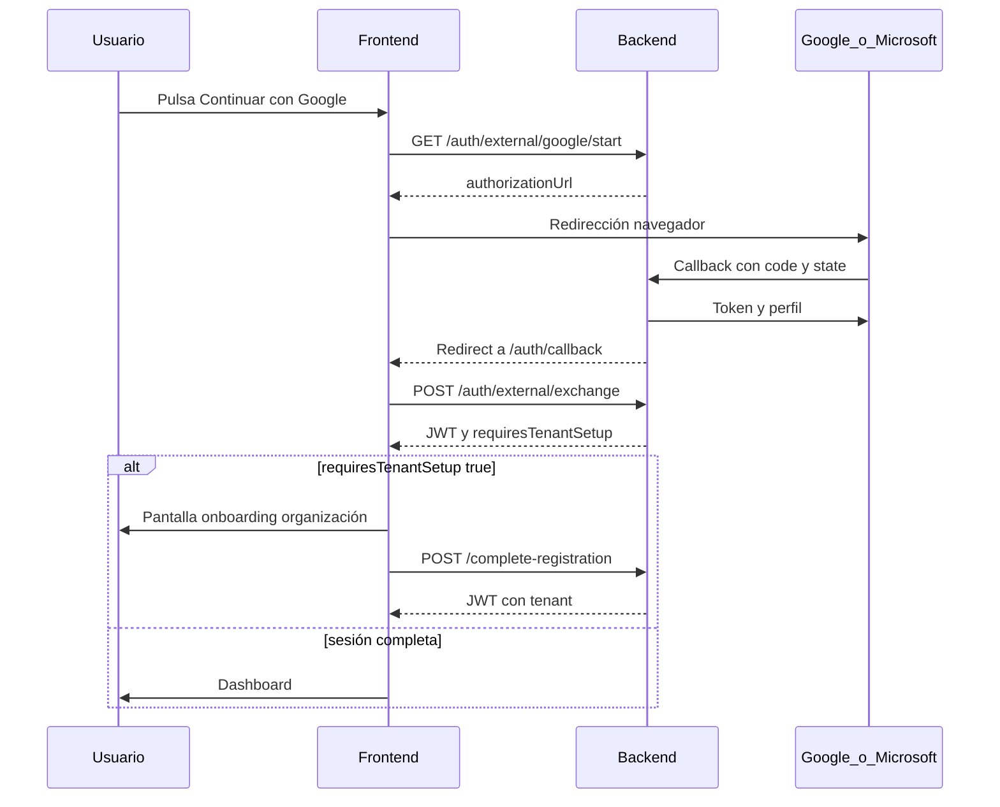

# Guía de implementación frontend — Login externo Google / Microsoft

Documento orientado al equipo de frontend. Describe **qué construir**, **en qué orden** y **qué reglas respetar**, alineado con el plan backend [`plan-login-externo-google-microsoft.md`](./plan-login-externo-google-microsoft.md) y con la API ya disponible bajo `/api/auth/external`.

**Alcance V1:** inicio de sesión y registro unificado con Google y Microsoft, onboarding de workspace propio, aceptación de invitaciones vía OAuth, manejo de errores y sesión JWT restringida hasta completar organización.

**Fuera de alcance V1:** vincular un segundo proveedor estando ya logueado (Google + Microsoft en la misma cuenta), cambio de email de plataforma desde el IdP, pantallas de administración de abandonos de onboarding.

---

## 1. Principios de producto

### Un solo botón por proveedor

El usuario no debe elegir entre “iniciar sesión” y “registrarse” antes de pulsar Google o Microsoft. El backend usa `intent=auto` (valor por defecto) y decide si la identidad ya existe, si debe crearse, si hay conflicto o si aplica una invitación.

En pantalla de login/registro conviene mostrar:

- Continuar con Google  
- Continuar con Microsoft  
- Iniciar sesión con email y contraseña (flujo existente)  
- Registrarse con email (flujo existente, sin crear tenant en el mismo paso)

### Dos capas separadas

| Capa | Qué resuelve | Cuándo termina |
|------|----------------|----------------|
| **Identidad (OAuth)** | Quién es el usuario y vínculo con Google/Microsoft | Tras `POST /api/auth/external/exchange` con JWT guardado |
| **Workspace** | A qué organización pertenece o cuál es la suya | Tras completar onboarding o aceptar invitación |

No se pide nombre de organización en `/start` ni antes del redirect al proveedor. El nombre del tenant se recoge **después** del OAuth, solo si el backend indica que falta workspace.

### El callback del IdP no va al frontend directamente

Google y Microsoft redirigen al **backend** (`/api/auth/external/{provider}/callback`). El backend procesa todo y luego redirige al frontend (por defecto a `/auth/callback`) con parámetros en la URL. El frontend **no** intercambia el `code` de OAuth; solo recibe un `exchangeCode` opaco o un código de error.

---

## 2. Arquitectura del flujo (visión general)

---

## 3. Rutas y pantallas que debe tener el frontend

| Ruta sugerida | Responsabilidad |
|---------------|-----------------|
| `/login` (o equivalente) | Botones OAuth + login password |
| `/register` (o equivalente) | Botones OAuth + registro password (sin tenant) |
| `/auth/callback` | Página receptora del redirect post-OAuth: lee URL, llama exchange, redirige |
| `/onboarding` (o `/complete-registration`) | Formulario con **nombre de organización obligatorio** para usuarios OAuth nuevos |
| `/invite` (existente) | Añadir botones OAuth que pasen `invitationToken` al iniciar OAuth |

La ruta `/auth/callback` debe existir en el **mismo origen** configurado en backend (`ExternalAuth:FrontendApp:BaseUrl`). El backend redirige ahí en éxito y en error (salvo `returnUrl` válido en éxito).

---

## 4. Flujo detallado — login o registro OAuth

### Paso 1 — Iniciar OAuth

Llamar al backend (sin JWT):

- **Método y ruta:** `GET /api/auth/external/{provider}/start`
- **Proveedor:** `google` o `microsoft` (minúsculas en la URL)
- **Query opcionales:**
  - `intent`: omitir o `auto` en producto estándar; solo usar `login` o `register` si hay requisito legal explícito
  - `invitationToken`: token de la URL `/invite?token=...` cuando el usuario viene de una invitación
  - `returnUrl`: ruta relativa del frontend tras éxito (debe estar en la allowlist del backend, p. ej. `/`, `/dashboard`, `/onboarding`, `/auth/callback`)

**Respuesta exitosa:** objeto con `authorizationUrl`. El frontend debe redirigir el navegador completo a esa URL (no iframe).

**Errores posibles en este paso:** proveedor inválido (400), `returnUrl` no permitida (400), rate limit (429).

### Paso 2 — Página `/auth/callback`

Tras el redirect del backend, la URL puede traer:

**Éxito:**

- `provider` — `google` o `microsoft`
- `exchangeCode` — código opaco de un solo uso (~60 segundos)
- `authAction` — hint informativo: `login`, `pending_setup` o `invitation_accepted`

**Error:**

- `error` — código estable (ver sección 8)
- `provider`
- Opcional: `existingProvider` — `google`, `microsoft` o `local` para mejorar el mensaje cuando el email ya está en uso

**Si hay `error`:** mostrar mensaje traducido, no llamar a exchange, ofrecer acciones según la tabla de errores. Fin del flujo.

**Si hay `exchangeCode`:** continuar al paso 3. **No** decidir la navegación final solo con `authAction`.

### Paso 3 — Intercambiar código por JWT

Llamar (sin JWT previo):

- **Método y ruta:** `POST /api/auth/external/exchange`
- **Cuerpo:** campo `exchangeCode` con el valor recibido en la URL

**Respuesta exitosa:**

- `data` — mismo formato que login password (`token`, `idUsuario`, `email`, `rol`, `fullName`, etc.)
- `requiresTenantSetup` — booleano en la raíz de la respuesta (no solo dentro de `data`)

Guardar el JWT como en el login clásico (mismo almacenamiento, mismos interceptores).

**Decisión de navegación (fuente de verdad):**

| Condición | Destino |
|-----------|---------|
| `requiresTenantSetup === true` | Pantalla de onboarding (`/onboarding`) |
| `requiresTenantSetup === false` y JWT incluye tenant | Dashboard o `returnUrl` si se validó antes |
| Invitación aceptada vía OAuth | Dashboard del tenant invitado (`requiresTenantSetup` será false) |

El claim JWT `setupStatus=pending_tenant` debe usarse solo para coherencia de UI (badges, ocultar selector de tenant), **no** como única señal de permisos: el backend bloquea el resto de APIs.

### Paso 4 — Completar registro (solo si `requiresTenantSetup`)

Pantalla con un campo obligatorio: **nombre de la organización** (`tenantName`). No usar nombre de persona como valor por defecto enviado al backend; el usuario debe escribirlo.

Llamar **con JWT** del paso 3:

- **Método y ruta:** `POST /api/auth/external/complete-registration`
- **Cuerpo:** `tenantName` (obligatorio, máximo 200 caracteres)

**Respuesta exitosa:** nuevo JWT en el mismo formato de login, con `requiresTenantSetup: false` y claims de tenant. Reemplazar el token almacenado y navegar al dashboard.

**Errores relevantes:** nombre vacío (`invalid_tenant_name`), usuario que ya no necesita onboarding (`tenant_setup_not_required`), ya tiene organización (`tenant_already_exists`), tenant suspendido (`tenant_setup_not_allowed`).

---

## 5. Flujo password existente (convivencia)

El registro con email **no** crea tenant en el mismo request. Tras verificar correo, el usuario queda en `PendingTenantSetup` y debe completar workspace con:

- `POST /api/account/complete-workspace-setup` — **misma pantalla de onboarding** que OAuth, mismo campo `tenantName`, mismo mensaje de producto

Recomendación: **una sola pantalla de onboarding** reutilizable; solo cambia el endpoint según el origen:

| Origen del usuario | Endpoint de completar workspace |
|--------------------|----------------------------------|
| Registro password + verify email | `POST /api/account/complete-workspace-setup` |
| OAuth nuevo sin invitación | `POST /api/auth/external/complete-registration` |

Ambos devuelven JWT completo al terminar.

### Usuario solo OAuth (sin contraseña)

Si intenta login con email/password, el backend responde con código `password_login_not_available`. La UI debe indicar que use Google/Microsoft o “Olvidé mi contraseña” para establecer una contraseña local (flujo híbrido).

---

## 6. Flujo de invitación

### Desde `/invite?token=...`

1. Mostrar botones “Continuar con Google” y “Continuar con Microsoft”.
2. Al pulsar, llamar a `/start` incluyendo `invitationToken` con el token de la URL.
3. Tras exchange, si la invitación fue aceptada, `requiresTenantSetup` será **false** y el JWT incluirá el tenant invitado → ir al dashboard de ese workspace, **no** a onboarding.

### Sin token pero con invitación pendiente

Si el usuario pulsa OAuth genérico en login y tiene **una sola** invitación pendiente para su email, el backend puede aceptarla automáticamente. Si tiene **varias** invitaciones para el mismo email, recibirá error `EXTERNAL_AUTH_MULTIPLE_PENDING_INVITATIONS`: debe usar el enlace del correo de cada invitación.

### Email del IdP distinto al de la invitación

Error `EXTERNAL_AUTH_INVITATION_EMAIL_MISMATCH`. Pedir usar la cuenta invitada o solicitar nueva invitación al administrador.

---

## 7. Sesión JWT restringida (`PendingTenantSetup`)

Mientras `requiresTenantSetup` sea true (o el claim `setupStatus` sea `pending_tenant`), el usuario tiene sesión válida pero **limitada**.

### Endpoints permitidos con ese JWT

| Endpoint | Uso en frontend |
|----------|-----------------|
| `GET /api/me` | Mostrar nombre/email en pantalla de onboarding |
| `POST /api/token/refresh` | Renovar sesión; debe conservar `requiresTenantSetup: true` |
| `POST /api/auth/external/complete-registration` | Crear organización (OAuth) |
| `POST /api/account/complete-workspace-setup` | Crear organización (password) |

### Bloqueados hasta completar onboarding (403 `tenant_setup_required`)

Incluye, entre otros: listar tenants, crear tenant personal por otra ruta, editar perfil (`PUT /api/me`), avatar, preferencias, integraciones, media, social, posts.

El frontend debe:

- No montar layout con selector de tenant ni módulos de producto.
- Redirigir a `/onboarding` si detecta `requiresTenantSetup` o `setupStatus=pending_tenant` al cargar la app.
- Tratar 403 con código `tenant_setup_required` como señal para volver a onboarding.

### Reanudación tras abandonar onboarding

Si el usuario cerró el navegador en la pantalla de nombre de organización pero ya hizo OAuth una vez, al volver a pulsar el mismo proveedor **no** se crea cuenta duplicada. Tras exchange, `requiresTenantSetup` seguirá en true hasta completar el paso 4.

---

## 8. Errores — redirect (query `error`)

Traducir siempre a mensajes humanos; **no** mostrar el código crudo al usuario.

| Código backend | Cuándo ocurre | Mensaje sugerido (es) | Acción en UI |
|----------------|---------------|------------------------|--------------|
| `EXTERNAL_AUTH_EMAIL_ALREADY_EXISTS` | Email ya registrado con otro método, sin invitación aplicable | Ya existe una cuenta con este correo. Inicia sesión con el método que usaste antes. Luego podrás vincular {proveedor} desde tu perfil. | Si viene `existingProvider`, personalizar (“vinculada a Google”, “con email”, etc.) |
| `EXTERNAL_AUTH_ACCOUNT_BLOCKED` | Cuenta eliminada, suspendida o inactiva | No podemos iniciar sesión con esta cuenta. Contacta al administrador. | Sin reintento OAuth automático |
| `EXTERNAL_AUTH_EMAIL_NOT_VERIFIED` | IdP no marcó el email como verificado | Verifica tu correo en {proveedor} e inténtalo de nuevo. | Reintentar |
| `EXTERNAL_AUTH_CANCELLED` | Usuario canceló en Google/Microsoft | Cancelaste el inicio de sesión con {proveedor}. | Botón reintentar |
| `EXTERNAL_AUTH_FAILED` | Fallo técnico o sesión OAuth inválida | No pudimos completar el inicio de sesión. Inténtalo más tarde. | Reintentar |
| `EXTERNAL_AUTH_MULTIPLE_PENDING_INVITATIONS` | Varias invitaciones para el mismo email | Tienes varias invitaciones pendientes. Abre el enlace del correo de invitación. | — |
| `EXTERNAL_AUTH_INVITATION_EMAIL_MISMATCH` | Cuenta IdP ≠ email invitado | El correo de {proveedor} no coincide con el de la invitación. | — |
| `EXTERNAL_AUTH_INVITATION_INVALID` | Token de invitación inválido o expirado | El enlace de invitación no es válido o ha expirado. | Contactar admin |
| `EXTERNAL_AUTH_ACCOUNT_NOT_FOUND` | Solo con `intent=login` estricto | No encontramos cuenta vinculada con {proveedor}. | Registro o login email |
| `EXTERNAL_AUTH_ALREADY_REGISTERED` | Solo con `intent=register` estricto | Ya tienes cuenta con {proveedor}. Inicia sesión con el mismo botón. | — |

Sustituir {proveedor} por “Google” o “Microsoft” según el parámetro `provider` de la URL.

---

## 9. Errores — `POST /exchange` (JSON)

| Código / mensaje | HTTP | Mensaje sugerido (es) |
|------------------|------|------------------------|
| `invalid_exchange_code` | 401 | La sesión expiró. Vuelve a iniciar sesión con Google o Microsoft. |
| `account_inactive` | 403 | Tu cuenta está inactiva. Contacta al administrador. |

Si el exchange falla por expiración, el usuario debe repetir el flujo desde el botón OAuth (nuevo `/start`).

---

## 10. Errores — login password relacionados con OAuth

| Código | Mensaje sugerido (es) |
|--------|------------------------|
| `password_login_not_available` | Esta cuenta usa inicio de sesión con Google o Microsoft. Usa ese método o restablece una contraseña desde “Olvidé mi contraseña”. |
| `tenant_setup_required` | Debes crear tu organización antes de continuar. |

---

## 11. Qué usar y qué no usar para decidir permisos

| Señal | ¿Usar para navegación / permisos? |
|-------|-----------------------------------|
| Query `authAction` | Solo hint UX, analytics o copy provisional — **no** para routing definitivo |
| Query `error` | Sí, en pantalla de callback antes de exchange |
| `requiresTenantSetup` en respuesta de exchange o refresh | **Sí** |
| Claim JWT `setupStatus` | Sí, para UI (coherente con backend) |
| Claims JWT `tenant`, roles | Sí, cuando `requiresTenantSetup` es false |
| `GET /api/me` tras login | Sí, para validar sesión |

---

## 12. Refresh de token

`POST /api/token/refresh` funciona con JWT de usuario en `PendingTenantSetup`: devuelve nuevo token **limitado** con `requiresTenantSetup: true`.

No refresca sesión si el usuario aún no verificó email (`email_not_verified`).

Tras `complete-registration` o `complete-workspace-setup`, el refresh devuelve JWT completo con tenant.

---

## 13. Rate limiting

Los endpoints `/start`, `/exchange` y `/complete-registration` tienen límite por IP. Ante HTTP 429, mostrar mensaje de “demasiados intentos” y respetar cabecera `Retry-After` si está presente.

---

## 14. V2 — no implementar aún

- Vincular segundo proveedor desde configuración de cuenta (`/link`)
- Desvincular proveedor
- Listar proveedores vinculados en perfil
- Cambiar email de plataforma sincronizado desde Google/Microsoft

En V1, si el usuario tiene Google y intenta Microsoft con el mismo email sin estar logueado, verá conflicto `EXTERNAL_AUTH_EMAIL_ALREADY_EXISTS`.

---

## 15. Checklist de implementación

- [ ] Botones “Continuar con Google” y “Continuar con Microsoft” en login y registro
- [ ] Ruta `/auth/callback` que procese éxito y error del redirect
- [ ] Llamada obligatoria a `POST /exchange` tras éxito; guardar JWT
- [ ] Navegación según `requiresTenantSetup`, no según `authAction`
- [ ] Pantalla de onboarding con `tenantName` obligatorio
- [ ] Endpoint correcto: `complete-registration` (OAuth) vs `complete-workspace-setup` (password)
- [ ] Reutilizar la misma pantalla de onboarding para ambos orígenes
- [ ] Botones OAuth en `/invite` con `invitationToken`
- [ ] Mapa de traducción de códigos `EXTERNAL_AUTH_*`
- [ ] Manejo de `password_login_not_available` en login email
- [ ] Layout restringido sin tenant mientras `requiresTenantSetup`
- [ ] Manejo de 403 `tenant_setup_required` en llamadas API
- [ ] Refresh de token que preserve estado de onboarding
- [ ] Pruebas manuales: usuario nuevo OAuth, conflicto email, invitación, abandono y re-OAuth, cancelación en IdP

---

## 16. Pruebas recomendadas (QA frontend)

1. **Usuario nuevo OAuth** — exchange con `requiresTenantSetup: true` → onboarding → dashboard con tenant.  
2. **Usuario existente OAuth** — login directo al dashboard sin onboarding.  
3. **Email ya usado con password** — redirect con `EXTERNAL_AUTH_EMAIL_ALREADY_EXISTS`.  
4. **Invitación** — OAuth desde `/invite` → dashboard del tenant sin pasar por onboarding.  
5. **Abandono** — OAuth, cerrar en onboarding, volver a OAuth → misma cuenta, onboarding pendiente.  
6. **JWT restringido** — con onboarding pendiente, confirmar que rutas de producto devuelven 403 y la app no las muestra.  
7. **Solo OAuth** — login password muestra mensaje adecuado.  
8. **Cancelar en Google/Microsoft** — mensaje y reintento.

---

## 17. Referencias backend

- Plan completo: [`plan-login-externo-google-microsoft.md`](./plan-login-externo-google-microsoft.md)  
- Resumen API: [`docs/Api Docs/Autenticación y cuenta/EXTERNAL-AUTH-OAUTH.md`](../Api%20Docs/Autenticación%20y%20cuenta/EXTERNAL-AUTH-OAUTH.md)  
- Onboarding password: `POST /api/account/complete-workspace-setup`  
- Login clásico: `POST /api/token/login`  
- Refresh: `POST /api/token/refresh`

---

*Última actualización: julio 2026 — alineado con backend OAuth V1 implementado.*
