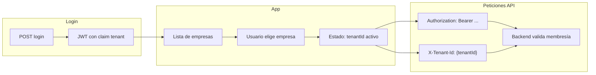

# Guía de consumo: sesión única y varias organizaciones (tenants)

Documento para el **equipo de frontend**: cómo encajar la lógica multi-tenant del backend DataColor en la aplicación (estado, cabeceras HTTP y renovación de sesión). Para la **referencia completa de endpoints** (tablas por ruta), usar además [`frontend-tenants-y-roles.md`](./frontend-tenants-y-roles.md).

---

## 1. Idea central

- El usuario **inicia sesión una sola vez** y recibe un **JWT**.
- Ese JWT puede incluir **varias organizaciones** (tenants) a las que pertenece, cada una con su **rol**.
- El servidor **no guarda** una “empresa seleccionada” en sesión: en **cada petición** el cliente debe indicar **con qué tenant** se opera (cuando la ruta lo exige).

---

## 2. Autenticación

- **Login:** `POST /api/token/login` (cuerpo con credenciales según contrato actual).
- Respuesta típica incluye **`token`** (JWT) y datos básicos del usuario (`idUsuario`, `email`, `rol` global de aplicación, etc.).
- Guardar el JWT de forma segura (memoria + refresh según vuestra política).

**Importante:** el rol “global” del JSON de login **no** sustituye al rol **dentro de un tenant**. Para permisos por organización usad el claim `tenant` del JWT o los datos de **`GET /api/tenants`** (ver §3).

---

## 3. Cómo obtener la lista de empresas del usuario

Tenéis dos opciones complementarias:

| Enfoque | Ventaja | Inconveniente |
|--------|---------|----------------|
| **Decodificar el JWT** (claim `tenant`) | Sin petición extra; rápido al arrancar | Solo ids y roles; **sin nombres**; puede estar **desactualizado** |
| **`GET /api/tenants`** con Bearer | Datos de BD: **`name`**, **`slug`**, **`role`**, etc. | Una llamada más tras login |

**Recomendación:** usar **`GET /api/tenants`** para pantallas de selección y menús (nombres legibles). Tras operaciones que cambien membresía o rol, **volver a llamar** este endpoint o forzar re-login si la API indica `requiresReauth` (ver §6).

**Formato del claim `tenant` en el JWT (usuarios Customer):** array JSON de strings `"idRol:codigoRol"`, por ejemplo `["12:TenantOwner","34:Editor"]`. El orden y el formato exacto lo construye el backend al emitir el token.

---

## 4. Elegir la “empresa activa” en el cliente

- Si **`count === 1`**, podéis **fijar ese tenant** automáticamente sin pantalla de elección.
- Si **`count > 1`**, mostrad un **selector** (lista desde `GET /api/tenants`) y guardad el **`tenantId`** elegido en estado global (Vue/Pinia, Redux, Context, etc.).
- Opcional: persistir la última empresa en **`localStorage`** para la próxima visita.

No hace falta un segundo login al cambiar de empresa: solo cambia el **`tenantId`** que enviáis en las peticiones.

---

## 5. Cómo debe ir cada petición al “workspace”

Muchas rutas exigen que el usuario sea **miembro del tenant** (política **TenantMember**). El backend resuelve el tenant en este **orden**:

1. Cabecera **`X-Tenant-Id`** (recomendada para el cliente).
2. Si no: parámetro de ruta **`tenantId`** (p. ej. `/api/tenants/{tenantId}/...`).
3. Si no: query **`tenantId`**.

**Convención práctica:** configurar un **interceptor HTTP** que añada siempre:

- `Authorization: Bearer <jwt>`
- `X-Tenant-Id: <tenantId activo>` en todas las llamadas que correspondan al workspace actual (excepto rutas globales que no lo requieran, p. ej. solo `GET /api/tenants` o `GET /api/tenants/roles`).

El middleware del servidor rellena el **contexto del tenant** (incluido el rol en ese tenant) a partir del JWT + el `tenantId` resuelto.

---

## 6. Comprobar que el contexto es correcto (opcional)

- **`GET /api/tenants/current`** requiere ya **TenantMember** (es decir, `X-Tenant-Id` o `tenantId` en ruta/query). Útil para depuración o para confirmar `tenantId` y `roleInTenant` en el servidor.

---

## 7. Cuándo renovar token o volver a iniciar sesión

- Tras cambios de **rol**, **alta/baja** en el tenant, **transferencia de propiedad**, etc., la API puede devolver **`requiresReauth: true`** en el cuerpo y/o la cabecera **`X-Requires-Reauth: true`**.
- **Acción del cliente:** obtener un **JWT nuevo** (login de nuevo o endpoint de refresh si está disponible) y **actualizar** lista de tenants y permisos en UI.

Detalle de qué endpoints disparan esto: ver sección 5 de [`frontend-tenants-y-roles.md`](./frontend-tenants-y-roles.md).

**Invitaciones:** al aceptar una invitación, la respuesta suele incluir un **nuevo JWT** en `data`: sustituir el token guardado y actualizar estado.

---

## 8. Códigos HTTP que veréis a menudo

| Código | Significado típico |
|--------|---------------------|
| **401** | Token ausente, expirado o inválido |
| **403** | Autenticado pero **sin acceso** al tenant (mal `X-Tenant-Id`, o usuario no miembro según JWT) |
| **400** | Regla de negocio (mensaje en `data`) — p. ej. no podéis degradar a un Owner |

---

## 9. Usuarios Internal vs Customer

- Esta guía aplica a **`userType: Customer`** en el JWT (clientes con workspaces por tenant).
- Los usuarios **Internal** (plataforma/backoffice) siguen otros controladores; **no** usan el mismo flujo de `X-Tenant-Id` para operar como miembro de empresa.

---

## 10. SPA en otro origen (CORS)

Si el front y la API están en **dominios distintos**, la configuración CORS del servidor debe permitir las cabeceras que usáis (**`Authorization`**, y si añadís cabecera personalizada, **`X-Tenant-Id`**). Si el navegador bloquea la petición preflight, revisad política CORS en el host de la API.

---

## 11. Documentación relacionada

| Documento | Contenido |
|-----------|-----------|
| [`frontend-tenants-y-roles.md`](./frontend-tenants-y-roles.md) | Tablas de endpoints, invitaciones, transferencia de propiedad, `ApiResponse` |
| [`reglas-membresia-y-roles-tenant.md`](./reglas-membresia-y-roles-tenant.md) | Reglas de negocio (owners, admins, invariantes) |

---

*Mantener alineado con cambios en `TenantMemberHandler`, `TenantContextMiddleware` y controladores bajo `/api/tenants`.*
